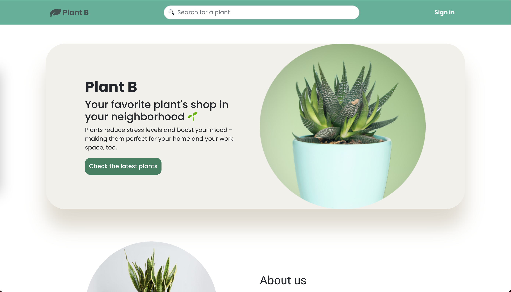
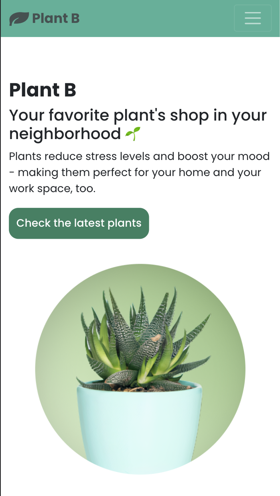

<h1 align="center">Welcome to  <strong>PlantB</strong> :seedling: </h1>

 This is a project made with React hooks fully responsive, we have three types of roles (user, shop, admin). Our users can buy and sell plants, can send messages to each other and it renders different info taking into consideration if you are or aren´t signed in and which role is logged in. We have a search bar made with Ajax on the navbar. We have apis as Google Maps. 

  
   
  
    
  
   
  
   

   

   

   

   
   
   
  

## The website

  Check the website here: https://plantb.herokuapp.com

 

  
  

  large screen and mobile screen preview.
 

FRONT PATHS:

| Path                  | Description                           | 
| --------------------- | ------------------------------------- |
| /register             | Form to register                      |
| /login                | Form to sing in                       |
| /                     | View that shows homepage              |
| /search               | Displays product                      |
| /item/:id             | Description of a single product       |
| /user/:username       | User's profile                        |
| /shop/:name           | Shows a shop's profile                |
| /edit/:username       | User is able to edit it's own profile |
| /edit/:shop           | Shop is able to edit it's own profile |
| /new-item             | Upload a product                      |
| /admin/shop           | Shop's entire list                    |
| /admin/user           | User's entire list                    |
| /admin/shop/:name     | Edit and delete shops info            |
| /admin/user/:username | Edit and delete users info            |
| /admin/item/:id       | Edit and delete items info            |
| /admin/control        | Approves shops regiter application    |
| /new-comment          | Creates a comment                     |
| /sendmsg/:targetname  | Sends message to a shop or user       |
| /messages             | Shows a message list                  |
| /cart                 | Shows the cart                        |

BACK PATHS:

| METHOD |         PATH          |              DESCRIPTION               |
| ------ | --------------------- | -------------------------------------- |
|  POST  |        /signup        |     Saves the user in the Database     |
|  POST  |     /signup-shop      |     Saves the shop in the Database     |
|  POST  |        /login         |     Logs the user in the Database      |
|  POST  |      /login-shop      |     Logs the shop in the Database      |
|  GET   |        /logout        | Logs the user/shop out of the database |
|  POST  |      /isloggedin      | Check if the user/shop has been logged |
|  GET   |      /plant/:id       |             Gets one plant             |
|  GET   |    /user/:username    |             Gets one user              |
|  PUT   |    /user/:username    |               Edit user                |
|  GET   |      /shop/:name      |             Gets one shop              |
|  PUT   |      /shop/:name      |               Edit shop                |
|  PUT   |     /plant/:name      |               Edit Plant               |
|  GET   |        /search        |       Gets all items/users/shops       |
|  POST  |      /new-plant       |           Create a new plant           |
|  GET   |     /admin/users      |         Gets list of all users         |
|  GET   |     /admin/shops      |         Gets list of all shops         |
|  PUT   | /admin/user/:username |             Edit one user              |
|  DEL   | /admin/user/:username |            Delete one user             |
|  PUT   |   /admin/shop/:name   |             Edit one shop              |
|  DEL   |    /admin/shop/:id    |            Delete one shop             |
|  GET   |    /admin/control     |          Gets shops requests           |
|  POST  |    /admin/control     |          Approve shop request          |
|  DEL   |    /admin/control     |          Decline shop request          |
|  DEL   |      /plant/:id       |        Admin can delete comment        |
|  POST  | /sendmsg/:targetname  |           Create new message           |
|  GET   |       /messages       |         Gets list of messages          |
|  GET   |     /message/:id      |            Gets one message            |
|  DEL   |     /message/:id      |           Delete one message           |
|  DEL   |     /comment/:id      |       (Admin) Delete one comment       |
|  POST  |     /comment/:id      |           Create new comment           |
|  GET   |     /comment/:id      |            Gets one comment            |
|  GET   |     /:id/comments     |      View one item's all comments      |
|  GET   |     /cart/:id         |      cart of the selected product      |
|  POST  |     /cart             |      gets plant details                |
